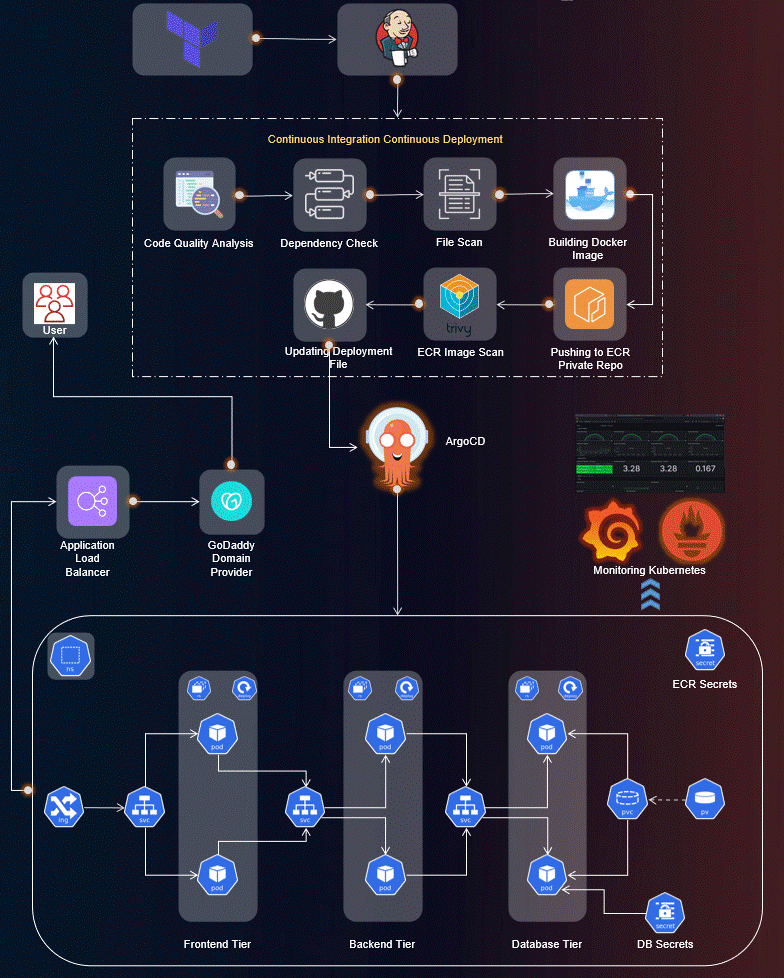

# Three Tier Kubernetes DevSecOps Pipeline



This project demonstrates an end-to-end DevSecOps implementation on Kubernetes, hosted on AWS, with a focus on security, monitoring, and scalability. The architecture follows the Three-Tier pattern, combining best practices in infrastructure automation, application deployment, and security integration.

## Overview

The workflow is structured into the following key stages:

1. **IAM User Setup**: Create an IAM user on AWS with necessary permissions.
2. **Jenkins Server Configuration**: Use Terraform and AWS CLI to set up a Jenkins server on AWS.
3. **EKS Cluster Deployment**: Set up an Amazon EKS cluster using `eksctl` or you can use this [repository](https://github.com/AbhishekGujjar17/EKS_With_Terraform_And_Github_Actions) to set it up using terraform.
4. **Amazon ECR**: Create private repositories for Docker images.
5. **ArgoCD Integration**: ArgoCD for continuous delivery and GitOps.
6. **Sonarqube Integration**: Enable code quality analysis in the DevSecOps pipeline.
7. **Monitoring**: Use Helm, Prometheus, and Grafana for EKS cluster monitoring.
8. **Application Deployment**: Deploy the Three-Tier application using ArgoCD.
9. **DNS Configuration**: Configure DNS for custom subdomains.
10. **Data Persistence**: Implement persistent volume claims for database pods.
11. **Final Monitoring**: Summarize achievements and monitor performance with Grafana.

## Prerequisites

1. **AWS Account**: Ensure you have an AWS account with the required permissions.
2. **Terraform and AWS CLI**: Install and configure Terraform and the AWS CLI.

## Directory Structure

```
├── Application-Code: Contains the source code for the Three-Tier Web Application, including frontend and backend.

├── Jenkins-Pipeline-Code: Includes Jenkins pipeline scripts for automating CI/CD processes.

├── Jenkins-Server-TF: Holds Terraform scripts for provisioning the Jenkins server on AWS.

├── Kubernetes-Manifests-Files: Contains Kubernetes manifests for deploying the application on AWS EKS.
```

## Deployment Steps

### Clone the Repository

Clone the repository to your local machine:

```bash
git clone https://github.com/AbhishekGujjar17/Three_Tier_kubernetes_DevSecOps_Pipeline.git.
```

### Provision the Infrastructure

Navigate to the `Jenkins-Server-TF` terraform directory and execute the following commands:

- Modify `backend.tf` for S3 bucket and DynamoDB table.
- Replace the `.pem` file name for SSH.
- Initialize and validate Terraform:
  ```bash
  terraform init
  terraform validate
  ```
- Plan and apply the infrastructure:
  ```bash
  terraform plan -var-file=variables.tfvars
  terraform apply -var-file=variables.tfvars --auto-approve
  ```

### Jenkins Server Configuration

- Access your `EC2` instance on AWS via SSH.
- Verify installations:
  ```bash
  jenkins --version
  docker --version
  terraform --version
  kubectl version
  aws --version
  trivy --version
  eksctl --version
  ```

### EKS Cluster Setup

- Create an EKS cluster using terraform by folllowing this [repository](https://github.com/AbhishekGujjar17/EKS_With_Terraform_And_Github_Actions).

  OR

  ```bash
  eksctl create cluster --name Three-Tier-K8s-EKS-Cluster --region us-east-1 --node-type t2.medium --nodes-min 2 --nodes-max 2
  aws eks update-kubeconfig --region us-east-1 --name Three-Tier-K8s-EKS-Cluster
  ```

- Validate nodes:
  ```bash
  kubectl get nodes
  ```

### Load Balancer Setup on EKS Cluster

- Configure the AWS Load Balancer Controller:
  ```bash
  helm repo add eks https://aws.github.io/eks-charts
  helm install aws-load-balancer-controller eks/aws-load-balancer-controller -n kube-system \
    --set clusterName=Three-Tier-K8s-EKS-Cluster
  ```

### Amazon ECR Setup

- Create private repositories for frontend and backend images.
- Authenticate and push images to ECR.

### ArgoCD Installation on EKS Cluster

- Install ArgoCD:
  ```bash
  kubectl create namespace argocd
  kubectl apply -n argocd -f https://raw.githubusercontent.com/argoproj/argo-cd/v2.4.7/manifests/install.yaml
  ```
- Expose ArgoCD server as a LoadBalancer and access via the browser.

### Sonarqube Integration

- Configure Sonarqube with Jenkins for code quality analysis.
- Generate tokens and set up webhooks.

### Jenkins Pipeline Configuration

- Add credentials for AWS, GitHub, and ECR.
- Install required Jenkins plugins.
- Create and configure Jenkins pipelines for backend and frontend deployment.

### Monitoring with Prometheus and Grafana

- Install Prometheus and Grafana using Helm.
- Access dashboards via LoadBalancer and visualize cluster metrics.

### Application Deployment with ArgoCD

- Connect private repository in ArgoCD.
- Create applications for database, backend, frontend, and ingress.

### Monitoring and Visualization

- Use Grafana to import Kubernetes monitoring dashboards.
- Monitor cluster performance and application metrics.

### Access the Application

Retrieve the ALB DNS from AWS console and access the application in your browser.

## Cleanup

To avoid incurring costs, destroy the resources once you're done:

```bash
terraform destroy
```

## Notes

- Ensure your configurations align with security best practices, such as using least privilege permissions and private subnets.
- The project can be customized to integrate other CI/CD tools or to adapt to specific organizational requirements.
- While this project isn't covered by the AWS free tier and may incur some costs, they typically range between $1 to $2 if you create, test, and then promptly destroy the resources. However, leaving them running continuously will result in a gradual increase in your bill.

## Questions?

Feel free to reach out at abhishekgujjar.info@gmail.com for any queries.
